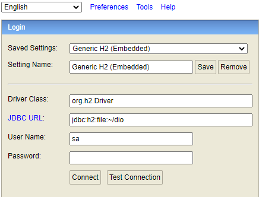

# SISTEMA DE CONTROLE DE PONTO 

##Ferramentas necessárias:

* Java 11 ou superior
* Spring boot
* Spring Data jpa
* Hibernate
* Lombok
* Swagger

### Acesso Banco de dados

Para acessar o banco é necessário executar o projeto. Após isso para acessar o banco de dados é necessário copiar o caminho: *http://localhost:8081/h2* após isso você será redirecionado para uma página como essa abaixo:

<h1 align="center">
    
</h1>
